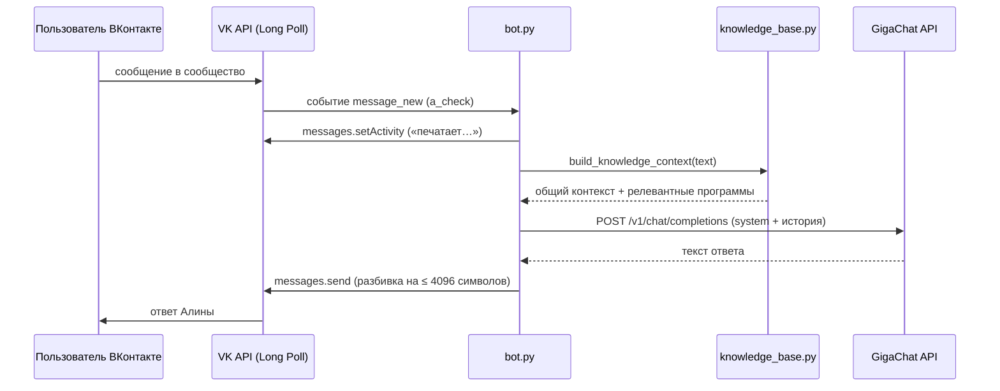

# Алина — чат-бот поддержки ВКонтакте на базе GigaChat

**Алина** — production-ready AI-чат-бот для сообщества ВКонтакте. Бот консультирует посетителей сообщества онлайн-университета Zerocoder: отвечает на вопросы о программах обучения, подбирает курсы под интересы пользователя и в нужный момент мягко собирает контакты для отдела продаж.

Бот построен на двух публичных API:
- **VK Bots Long Poll API** — приём и отправка сообщений без публичного HTTPS-сервера;
- **GigaChat API** (Sber) — генерация ответов на основе системного промпта и динамической базы знаний.

> Это учебный проект курса «Разработчик чат-ботов» (Zerocoder), упакованный как портфолио: подробное описание, архитектура, инструкция по запуску и модель ветвления Git Flow.

---

## Возможности

- Приём сообщений сообщества через **Bots Long Poll** (`a_check`) — не нужен публичный сервер или вебхук;
- Генерация ответов моделями **GigaChat** (`GigaChat`, `GigaChat-2-Pro`, `GigaChat-2-Max`);
- **База знаний** в формате JSON: об университете, направлениях, карточках курсов, тарифах, FAQ и контактах;
- **Контекстный поиск**: в промпт попадают только релевантные запросу программы (подбор по ключевым словам);
- **История диалога** для каждого пользователя (до 10 сообщений) — бот помнит контекст беседы;
- Индикатор **«печатает…»** (`messages.setActivity`) — естественный UX;
- **Авторазбивка** длинных ответов на сообщения ≤ 4096 символов;
- **Автопродление токена** GigaChat: кэширование на 30 минут и обновление при ответе `401`;
- Защита от дублей запуска: **single-instance lock** (Windows `msvcrt` / Linux `fcntl`);
- Секреты только в `.env` — в репозитории есть безопасный шаблон `.env.example`.

---

## Технологический стек

| Слой | Технология |
|---|---|
| Язык | Python 3.9+ |
| VK API | Bots Long Poll API, методы `messages.send`, `setActivity` |
| AI | GigaChat API (OAuth 2.0, `chat/completions`) |
| HTTP-клиент | `requests` |
| Конфигурация | `python-dotenv` |
| База знаний | JSON + системный промпт |

---

## Архитектура

Полная схема и поток сообщений — в [`docs/ARCHITECTURE.md`](docs/ARCHITECTURE.md).



---

## Структура проекта

```
VK_Gigachat/
├── bot.py                          # Точка входа: Long Poll-цикл, обработка событий, история
├── vk_client.py                    # Обёртка над VK API: Long Poll, send, activity
├── gigachat_client.py              # Обёртка над GigaChat: OAuth-токен + chat/completions
├── knowledge_base.py               # Загрузка JSON и подбор релевантных курсов
├── system_prompt.py                # Системный промпт Алины (роль, стиль, правила)
├── config.py                       # Переменные окружения и валидация
├── knowledge/
│   └── zerocoder_knowledge.json    # База знаний университета Zerocoder
├── docs/
│   └── ARCHITECTURE.md             # Схема работы и поток сообщений
├── .env.example                    # Шаблон конфигурации (без секретов!)
├── .gitignore
├── requirements.txt
├── LICENSE                         # MIT
└── README.md
```

---

## Быстрый старт

### 1. Клонирование

```bash
git clone https://github.com/Konstantin560/VK_Gigachat.git
cd VK_Gigachat
```

### 2. Установка зависимостей

```bash
python -m venv .venv
source .venv/bin/activate        # macOS / Linux
# .venv\Scripts\activate       # Windows

pip install -r requirements.txt
```

### 3. Настройка `.env`

```bash
cp .env.example .env
```

Заполните обязательные переменные (таблица ниже). Файл `.env` добавлен в `.gitignore` — **никогда не отправляйте его в Git**.

### 4. Запуск

```bash
python bot.py
```

В консоли появится лог «Бот Алина из Zerocoder запущен ...». Напишите сообщение в сообщество — ответ придёт через несколько секунд. Остановка — `Ctrl+C`.

---

## Переменные окружения

| Переменная | Обязательная | Описание | Где взять |
|---|---|---|---|
| `VK_GROUP_TOKEN` | Да | Токен доступа сообщества. Права: `messages`, `groups`. | Сообщество → Управление → Работа с API → Ключи доступа |
| `VK_GROUP_ID` | Да | Числовой ID сообщества (из адреса `https://vk.com/club12345678`). | Адрес сообщества / настройки |
| `VK_API_VERSION` | Нет | Версия VK API. По умолчанию `5.199`. | — |
| `GIGACHAT_AUTH_KEY` | Да | Ключ авторизации GigaChat (Base64 из `client_id:client_secret`). | Личный кабинет GigaChat API (developers.sber.ru) |
| `GIGACHAT_SCOPE` | Нет | Версия API: `GIGACHAT_API_PERS` / `GIGACHAT_API_B2B` / `GIGACHAT_API_CORP`. | Документация GigaChat |
| `GIGACHAT_MODEL` | Нет | Модель для генерации. По умолчанию `GigaChat`. | Метод `/v1/models` |
| `GIGACHAT_VERIFY_SSL` | Нет | Проверка SSL-сертификата GigaChat (`true`/`false`). | — |

---

## Как работает бот

1. **Long Poll** (`vk_client.py`) — бот получает сервер через `groups.getLongPollServer`, затем держит открытое соединение `a_check` и ловит событие `message_new`.
2. **Контекст знаний** (`knowledge_base.py`) — по тексту вопроса выбираются релевантные программы (по ключевым словам) и добавляются в системный промпт вместе с общей информацией об университете.
3. **Генерация** (`gigachat_client.py`) — бот получает OAuth-токен (`POST /api/v2/oauth`, заголовки `RqUID` и `Authorization: Basic`) и отправляет в `POST /v1/chat/completions` историю диалога с системным промптом. Токен кэшируется и обновляется при истечении или ответе `401`.
4. **Ответ** — отправляется через `messages.send` с обязательным `random_id`; статус «печатает…» — через `messages.setActivity`. Длинные ответы дробятся на части ≤ 4096 символов.

## База знаний

Вся информация об университете — в файле `knowledge/zerocoder_knowledge.json`:

- общая информация, направления и статистика;
- карточки курсов (название, категория, длительность, формат, инструменты, описание, ключевые слова);
- тарифы («Базовый», «VIP», «VIP+»), рассрочка и форматы;
- Карьерный центр, контакты, FAQ.

Правило бота: отвечать **только** на основе базы. Нет данных в базе — честно сказать и предложить передать вопрос менеджеру.

---

## Модель ветвления

Проект использует упрощённый Git Flow:

- `main` — стабильная версия, готовая к деплою;
- `develop` — интеграционная ветка для разработки;
- `feature/*` — отдельные фичи (например, `feature/gigachat-2-pro`), после проверки мержатся в `develop`.

---

## Что показывает этот проект (для портфолио)

- Интеграция **двух публичных API** (VK + GigaChat) в один сервис;
- работа с **OAuth 2.0** и автоматическим продлением токена;
- построение **контекстуальных промптов** из динамической базы знаний;
- модульная архитектура и **защита от дублей** процесса (single-instance lock);
- **безопасность**: секреты изолированы от кода, репозиторий публикуется только с `.env.example`.

---

## Лицензия

Проект распространяется по лицензии [MIT](LICENSE).
