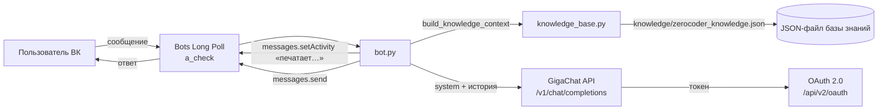

# Архитектура чат-бота «Алина»

## Общая схема

## Поток обработки сообщения

1. Сообщество ВКонтакте получает сообщение.
2. `bot.py` получает событие `message_new` через Long Poll (`vk_client._long_poll_events`).
3. Бот показывает статус «печатает…» (`messages.setActivity`).
4. `knowledge_base.build_knowledge_context(text)` собирает контекст:
   - общая информация об университете (`general`, `directions`);
   - релевантные программы, найденные по ключевым словам (`_match_keywords`);
   - форматы, Карьерный центр, контакты, FAQ.
5. `gigachat_client.chat()` добавляет системный промпт и историю диалога и отправляет запрос в **GigaChat**.
6. Ответ возвращается пользователю через `messages.send`; длинные ответы дробятся на части ≤ 4096 символов (`split_message`).

## Управление токеном GigaChat

- Токен получается один раз (`POST /api/v2/oauth`) и кэшируется до истечения срока (`expires_at − 60 сек`).
- При ответе `401` токен обновляется принудительно (`_ensure_token(force=True)`) и запрос повторяется.

## Устойчивость

- **Single-instance lock** `bot.lock` (Windows `msvcrt` / Linux `fcntl`) — не даёт запустить бота дважды и дублировать ответы.
- При ошибке сети Long Poll переподключается повторным получением сервера/ключа/ts.
- При ошибке GigaChat бот отвечает заготовкой с контактами менеджера.

## Безопасность

- Секреты читаются только из `.env`; в репозиторий попадает лишь шаблон `.env.example`.
- Ключ авторизации GigaChat передаётся только в заголовке `Authorization`, никогда в коде.
